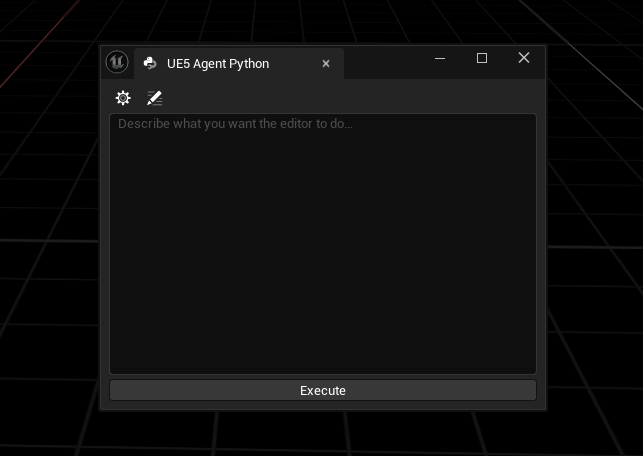

# UE5 Agent Python

[](https://www.unrealengine.com/)
[](LICENSE)
[](https://github.com/LucidDelta/UE5AgentPython/releases)
[](#)
[](#)
[](#)

> An AI-powered Python scripting assistant for Unreal Engine 5.5 — type what you want in plain English, get it done inside the editor.

<p align="center">
  
</p>

UE5 Agent Python is a UE 5.5 editor plugin that turns natural-language prompts into live Python executed against the editor. It reads your current selection (viewport + content browser) as context, sends the prompt to your chosen AI provider, and runs the returned code through `IPythonScriptPlugin`. Designed as a **power tool for senior UE devs** — batch and bulk operations, not gameplay logic.

## ✨ Features

- 🤖 **Multi-provider** — Anthropic Claude, OpenAI, or Google Gemini. Bring your own API key.
- 🧠 **Automatic context injection** — every prompt silently includes your current viewport selection, content browser selection, and active folder. Just say "these actors" or "this folder" and the model knows what you mean.
- 💬 **Conversation mode** — optional multi-turn history so the model remembers the prior turns.
- 📋 **In-panel log viewer** — scroll and copy the full prompt/response/execution trace without leaving the editor.
- ⚙️ **Collapsible settings** — gear icon hides provider, API key, and model pickers until you need them.
- 🔒 **Local, per-project key storage** — keys live in `GEditorPerProjectIni`, never in source.

## 📦 Installation

### Prerequisites

- **Unreal Engine 5.5**
- **Visual Studio 2022** with the *Desktop development with C++* workload
- An API key from one of:
  - [Anthropic Console](https://console.anthropic.com/) — Claude
  - [OpenAI Platform](https://platform.openai.com/) — GPT models
  - [Google AI Studio](https://aistudio.google.com/) — Gemini

The bundled `PythonScriptPlugin` and `EditorScriptingUtilities` are auto-enabled by the plugin descriptor.

### Install

1. Clone or download this repo into your project's `Plugins/` folder:
   ```
   <YourProject>/Plugins/UE5AgentPython/
   ```
2. Right-click your `.uproject` → **Generate Visual Studio project files**.
3. Open the generated `.sln`, select **Development Editor / Win64**, build.
4. Launch the editor. Accept any prompt to enable Python plugins.

## 🚀 Getting Started

1. Open the panel from **Tools → UE5 Agent Python**. Dock the nomad tab anywhere.
2. Click the ⚙️ gear to expand settings. Pick a provider, paste your API key, press Enter. The model combo populates from the provider's `/models` endpoint.
3. Close settings, type a prompt, hit **Execute**. Watch the **Running…** throbber until it clears.
4. Click the 📋 log icon to inspect the prompt, response, and Python stdout/stderr.

See [QUICKSTART.md](QUICKSTART.md) for a two-minute walkthrough.

## 💡 Usage Examples

The model has full access to the Unreal editor Python API plus `unreal.EditorAssetLibrary`, `unreal.EditorLevelLibrary`, `unreal.EditorFilterLibrary`, and friends. Here's what that buys you.

### 🏷️ Batch rename selected assets

> *"Rename every selected asset by replacing the prefix `SM_old_` with `SM_Prop_` and capitalizing the next word."*

The plugin injects the content browser selection automatically. The model walks `EditorAssetLibrary.rename_asset` over the list and reports a clean summary to the log.

### 🔗 Look up dependencies

> *"For every asset selected in the content browser, list its hard reference dependencies and which ones are also selected."*

Great for auditing a folder before you move or delete it. The model uses `AssetRegistryHelpers.get_asset_registry().get_dependencies()` and prints a Markdown-ish table into the log.

### 📁 Sort content into folders by type

> *"Sort every asset in the currently opened content browser folder into subfolders by class name — Meshes, Materials, Textures, Blueprints, etc. Create folders as needed."*

One prompt, hundreds of assets moved. The model uses `EditorAssetLibrary.rename_asset` to perform in-place folder moves that preserve references.

### 🌳 Organize the World Outliner

> *"For every actor in the level, move it into a World Outliner folder named after its static mesh asset's folder. Skip actors without a mesh."*

Also works in reverse — *"collapse all outliner folders containing fewer than 3 actors into their parent"*, *"group every selected actor into a new folder called 'Kitbash Pass 1'"*, etc.

### 🧱 Assemble meshes into a kitbash grid

> *"Take every static mesh asset under `/Game/Kitbash/Walls/` and any subfolders, and spawn one instance of each on a 10×10 grid in the current level, 500 units apart, starting at the origin. Put them in an outliner folder called 'KitbashPreview'."*

Recursive asset discovery + grid placement + outliner grouping in one shot. Ideal for prepping a visual library before a kitbash session.

---

Add `🗣️ Conversation mode` before any of the above and iterate: *"now rotate every third one 45 degrees"*, *"delete the ones under the Stone subfolder"*, and the model keeps the working set in context.

## 🧭 UI Reference

| Control | Purpose |
|---|---|
| ⚙️ **Gear** | Toggle provider / API key / model settings |
| 📋 **Log** | Toggle the scrollable, selectable session log panel |
| **Provider combo** | Anthropic Claude, OpenAI, or Google Gemini — swaps API key + model list |
| **API key field** | Per-provider key (password-masked). Press Enter to commit + fetch models |
| **Model combo** | Chat-capable models returned by the provider |
| **Status text** | `No key entered`, `Fetching models…`, `N models`, `Invalid key`, or `Fetch failed` |
| **Conversation mode** | Include prior prompts/responses in each new request |
| **Prompt box** | Multi-line natural-language prompt |
| **Execute** | Send prompt → receive Python → run it |
| **Running…** throbber | Visible from Execute click through Python completion |

## 🛠️ What Happens on Execute

1. Your prompt is combined with an auto-generated **context block** (viewport selection, content browser selection, active folder).
2. The combined prompt + a system prompt enforcing raw-Python output is sent to the chosen provider.
3. The response is stripped of stray markdown fences and written to `Saved/UE5AgentPython/generated_code.py`.
4. Python is executed via `IPythonScriptPlugin::ExecPythonCommand`, wrapped in a `StringIO` redirect so stdout/stderr are captured.
5. Everything (prompt, context, response, stdout) is appended to the rolling session log.

## 📂 Logs & Debugging

- **Session log:** `<YourProject>/Saved/UE5AgentPython/session.log` — also viewable in-panel via the 📋 icon.
- **Generated code:** `<YourProject>/Saved/UE5AgentPython/generated_code.py` — last executed snippet.
- **Python stdout:** `<YourProject>/Saved/UE5AgentPython/py_output.txt` — last run's captured output.
- **Unreal Output Log:** every event logged under category `LogUE5AgentPython`.

API keys are **never** written to any log file.

## 🔐 Settings Storage

Per-provider API keys and last-used model are saved to `GEditorPerProjectIni` under `[UE5AgentPython]`. This file lives in your user profile (`<Project>/Saved/Config/WindowsEditor/EditorPerProjectUserSettings.ini`) and is gitignored by default.

## ⚠️ Troubleshooting

| Symptom | Fix |
|---|---|
| Menu entry missing | Confirm the plugin built in Development Editor and is enabled in Plugins Browser |
| `Invalid key` status | Key is wrong or lacks permission for `/models` |
| `Fetch failed` status | Check network + Output Log under `LogUE5AgentPython` |
| Python runs but nothing happens | Open the in-panel log or `session.log`, look at the `PY_EXEC` block for the captured traceback |
| Duplicate menu entry after live-coding | Close the editor, delete `Binaries/` and `Intermediate/` in the plugin folder, rebuild |

## 🤝 Contributing

PRs welcome. If you're continuing work with your own Claude session, read [CLAUDE.md](CLAUDE.md) first — it covers the architectural quirks that are easy to trip over.

## 📜 License

MIT — see [LICENSE](LICENSE).
